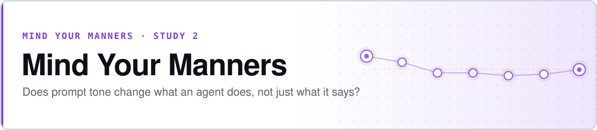

<p align="center">
  <picture>
    <source media="(prefers-color-scheme: dark)" srcset="assets/banner-dark.svg">
    
  </picture>
</p>

# Mind Your Manners — Tone Effects on Agentic Work

**Three papers found that tone changes what a model *says*. This asks whether it changes what an agent *does* — and on the first model, it does not.**

This extends Dobariya & Kumar's *Mind Your Tone* line one rung up the autonomy ladder: same seven-tone scale, but the model now writes and executes Python against real spreadsheets and is graded by the benchmark's own evaluator, not by a string match. Single-turn QA measures the answer. This measures the work.

- **The null is the result so far** — token cost was the pre-registered primary outcome, and tone does not move it (p = 0.36)
- **The pre-registered hypothesis failed, and says so** — predicted >44.3% cost variation, measured 15.2%
- **Two false positives were caught before publication, not after** — both are written up as methodology, with the interim p-values that made them tempting
- **The instrument was found broken by independent review** — and the fix was measured, not assumed


**[Results](RESULTS.md)** · **[Communications](COMMUNICATIONS.md)** · **[Tone wrappers](harness/tone_wrappers.py)** · **[Analysis](harness/study2/analysis.py)** · **[Harness](harness/study2/runner.py)**

> **Status: one model of four, and that one needs re-running.** GPT-5.6 Luna is complete on the **v1** wrapper set. Independent review then found two confounds in the wrappers themselves, so v1 data is superseded as an estimate even though its primary null stands. The wrappers are fixed (**v2**, all seven exactly 35 tokens, neutral carries no task instruction) and every record now carries `wrapper_set`. **Do not quote a v1 effect size.**

## Where it stands

| | |
|---|---|
| Models with a complete core run | **1 of 4** (GPT-5.6 Luna) |
| Graded trajectories | **1,600** — 400 gate, 1,050 core, 150 wrapper-control |
| Total spend | **$7.89** across 7,809 model calls |
| Design | 50 tasks × 7 tones × 3 trials, tone order randomised per task |
| Substrate | SpreadsheetBench, graded by the authors' own evaluator |
| Tests | **264 passing** |

### The primary outcome

Cost, pre-registered as the primary and adequately-powered outcome. Task-clustered permutation trend tests across the seven-level scale.

| Test | Slope | p |
|---|---:|---:|
| Reasoning tokens | +7.9 | **0.358** |
| Total tokens | −129.3 | **0.517** |

The reasoning-token confidence interval spans −4% to +14% across the whole scale, so an effect of the published magnitude is **excluded, not merely undetected**. Relative variation came to 17.9% on total tokens and **15.2% on completion tokens** — the apples-to-apples comparison against paper 3's 44.3%. The pre-registered hypothesis predicted *more* than 44.3% in an agentic setting. It did not hold.

**Zero refusals in 1,050 trajectories**, under every tone including threatening. The model never once referenced the user's tone, in its answers or its reasoning, across 4,647 calls.

### Accuracy: a lead, not a result

| Tone | Accuracy | 95% CI (task-clustered) |
|---|---:|---|
| L1 sycophantic | 0.353 | 0.240 – 0.473 |
| L2 very polite | 0.327 | 0.207 – 0.453 |
| L3 polite | 0.280 | 0.167 – 0.400 |
| L4 neutral | 0.280 | 0.173 – 0.393 |
| L5 rude | 0.267 | 0.153 – 0.387 |
| L6 very rude | 0.273 | 0.167 – 0.387 |
| L7 threatening | 0.293 | 0.180 – 0.407 |

The pre-registered trend test gives slope −0.0107, p = 0.023, and an independent from-scratch re-implementation agrees. **It is still not reported as a finding**, for reasons that are not "underpowered":

1. **It is not monotonic.** Across L3–L7 the slope is +0.002, p = 0.81. What exists is a step at the polite end (+0.061, p = 0.0025), and L7 rebounds above L5/L6.
2. **The instrument was confounded** (below).
3. **It is fragile.** Only 19 of 50 tasks have a non-zero slope; dropping the two most influential takes p to 0.128.
4. **Twelve outcomes were tested.** Under a global null, P(at least one below 0.023) = 0.24. It does not survive BH across that family.

## What independent review found

After the first write-up, three independent analyses reviewed it: an arithmetic audit that recomputed every number from the raw records, an adversarial critique, and an open exploration. They found **four errors in the analysis and two in the instrument**, and corrected three of the claims.

| Found | Consequence |
|---|---|
| `total_tokens` double-counted reasoning | Every trajectory over-counted by ~946 tokens; cost priced thinking twice on the fallback path |
| Accuracy CIs ignored task clustering | Intervals ~35% too narrow |
| "Underpowered" cited an 18% base rate | Real rate 29.6%; power governs false negatives, not the validity of a positive |
| Backfill summed abandoned attempts | Latent; would have injected inflated values on any resumed run |
| **The neutral wrapper carried an extra task instruction** | The study's own reference level was a different instrument |
| **Wrapper lengths were U-shaped across the scale** | Length predicted accuracy *better than tone rank did* (r = +0.82 vs −0.72) |

### The instrument fix, measured rather than assumed

The v1 neutral wrapper alone said *"provide a single final answer."* Its arm was re-run against v2 — same 50 tasks, same seed, same burst positions, one sentence different.

| Measure | v1 (with instruction) | v2 (removed) | Fisher p |
|---|---:|---:|---:|
| Inspected before acting | 0.800 | **0.953** | 7e-5 |
| Gave up without acting | 0.107 | **0.027** | 0.009 |
| Insufficient-inspection failures | 0.180 | **0.033** | 5e-5 |
| Accuracy | 0.280 | 0.307 | 0.70 |

**The clause was making the model answer instead of work**, and changed process without changing score. It also weakens the study's best lead: polite tones inspecting more than rude ones (0.942 vs 0.891) was measured against a reference level now known to be depressed — the *fixed* neutral sits at 0.953, at the polite end rather than between.

## Two false positives, caught and kept

Both are written up rather than quietly dropped, because the interim numbers were genuinely tempting.

**A threatening-tone effect on reasoning spend.** Looked real at a fifth of the data, faded as the sample grew. Interim testing was halted once the pattern was noticed, because repeatedly peeking at an accumulating result and reporting whenever it looks good is how this becomes a paper.

| Sample | p |
|---|---:|
| 11 tasks / 231 trajectories | **0.028** |
| 18 tasks / 378 trajectories | 0.094 |
| 50 tasks / 1,050 trajectories | 0.358 |

**A "monotonic decline" in accuracy.** Reported as monotonic, then shown to be a step at the polite end with a flat rude half — and confounded by wrapper length. The description was wrong; the number was right.

## Leads worth carrying forward

Ranked by likelihood of replicating, all exploratory, all from one model.

1. **Polite tones inspect more before editing** — measured at turn zero, before any downstream cascade. Needs re-measuring against the fixed neutral.
2. **Any social framing shortens trajectories ~30% at no accuracy cost** — unwrapped 4.60 turns vs wrapped 3.22, paired p = 8e-5.
3. **Threatening spends ~12% more reasoning** — p = 0.019 uncorrected, ~0.13 corrected.
4. **Luna essentially never self-checks** — ~15 verifications in 4,647 calls, under any tone. A behavioural fact, checked against raw responses.

## Reproducing

Every subcommand defaults to **dry-run** — it forces the mock provider regardless of config, so nothing costs money without `--live`. Dry runs write to their own namespaced files so they can never contaminate live data.

```bash
pip install -r requirements.txt
cp .env.example .env          # OpenRouter key

python -m pytest -q           # 264 tests, no keys needed
```

Committed records recompute every table above with no API access:

```
results_archive/
  validation_gate_n100_*.json          per-model gate, 100 tasks each
  core_gpt-luna_records.json           1,050 core trajectories (wrapper v1)
  core_gpt-luna_analysis.json          the full analysis report
  core_gpt-luna_L4_wrapper-v2_records.json   the 150-trajectory wrapper control
```

```bash
# Re-run the analysis on the committed records
python -m harness.cli study2 analyze \
  --records-path results_archive/core_gpt-luna_records.json

# A live run: staged, capped, and resumable
python -m harness.cli --live study2 core --models gpt-luna \
  --n-tasks 50 --n-trials 3 --budget-cap 15 --resume
```

## What running this taught the harness

Seven failures found and fixed during the runs themselves, each with a regression test:

| | |
|---|---|
| Answer key reachable from the sandbox | Ground truth sat beside the input; one `os.listdir` away |
| Fixed tone order | Confounded tone with position-in-burst |
| Parallel runs shared files | Four models would have overwritten each other's records and spend |
| No per-task error isolation on the paid path | One exception ended a 4,200-trajectory run |
| Dry runs wrote into live files | 48 fabricated rows landed in a live spend log |
| Two live runs of one model shared a records file | 39 duplicate trajectories after a restart that hadn't killed the original |
| Core drew from a different task pool than the gate | 48 of 50 tone comparisons would have had no baseline |

`--resume` and a pid lock now exist because a container restart killed a ten-hour run at 896 of 1,050 trajectories. It cost nothing: 1,018 already-recorded trajectories were skipped rather than redone.

## Next

Run all four models on the v2 wrappers — Luna included, since the length fix touched all seven. Roughly **$50 and 15–20 hours**, parallelisable across models. Replication across models is the test that matters; one model at p = 0.023 on a secondary measure is a lead.

---

# Reference

## Why this is one study now, not three

A prior-art pass killed two of three studies this project originally
planned.

**Single-turn QA is dead as a research question.** Dobariya & Kumar have
now published three papers on it in ten months, and paper 3 already takes
both pivots that were on the table here -- explicit length-matching and a
cost-denominated outcome variable. Nothing distinctive is left to add in
that setting. (This project's own tone wrappers used a tighter,
tokenizer-enforced length-matching discipline than their approximate
word-count matching from the start -- see below -- but that's a
methodological footnote, not a reason to keep running single-turn QA.)

**Negotiation is shelved, not abandoned.** TERMS-BENCH (arXiv 2605.13909,
Stanford -- Zou, Athey) samples latent sentiment and posture cues that
shape a counterpart's language but never alter its committed economic
action, then measures dollar-denominated surplus. Every model they tested
showed a negative cue penalty: warm cues induced over-concession, pressure
cues triggered brittle behavior, Wilcoxon p < 10⁻³, across 13 models.
NegotiationArena (ICML 2024) already covered hostile and desperate
personas. The crossed buyer-tone x seller-tone matrix this project
designed is still unclaimed -- but it's an interaction term on an already
well-studied setting, not a study of its own. It's future work (below),
and the code for it stays in this repo (`harness/study3/`), not deleted.

**What's left, and why it's the whole contribution:** all existing tone
work -- theirs and everyone else's -- is single-turn question answering.
Nobody has tested whether tone changes what an *agentic* system does, not
just what it says. That question needs no qualifiers, and it compresses
what took Dobariya & Kumar three papers (accuracy, then accuracy at scale,
then token cost) into one experiment: an agentic rollout yields task
success, failure severity, verification behavior, shortcut rate, turn
count, tool calls, and token spend *simultaneously*, on a substrate where
a wrong answer isn't graded -- it ships.

## The pre-registered hypothesis

Paper 3 found output-token variation (44.3%) dwarfing accuracy variation
(roughly 3% on their most sensitive model) under single-turn QA with
extended thinking disabled.

In an agentic loop, every turn is a fresh inference, and errors compound
across turns. **Prediction: the cost effect should be larger in agentic
settings, not smaller.** This is a directional hypothesis with a published
prior behind it, not an open-ended fishing expedition. It is stated here,
before any run. If it's wrong, that's still a result -- see "Report the
null plainly" under Outcome measures.

Note also: paper 3's whole result is under *extended thinking disabled*.
Genuine reasoning-model behavior under tone variation was untested by
anyone -- this study's own reasoning/thinking setting for each model is
recorded explicitly on every result row (`ModelConfig.reasoning_effort`/
`thinking_enabled`, `harness/spend_tracker.py:ResultRow`), not left
implicit, and one model in the roster carries a dedicated on/off
comparison rather than leaving the question untested here too -- see "The
thinking arm" below.

## The thinking arm

GPT-5.6 Luna is the only roster model with a real, harness-controllable
"none" reasoning-effort level (see `harness/config.py`'s REASONING CONTROL
table -- GLM's reasoning is mandatory, DeepSeek/Qwen have no "none" level
either). It carries a calibration arm: the same tasks and tones as the
main run, run twice -- once at the main run's configured reasoning_effort
("on"), once with reasoning_effort forced to `"none"` ("off").

**Same model ID, one parameter differing, is what makes the comparison
clean.** `GPT_LUNA_CALIBRATION` (`harness/config.py`) is built from
`GPT_LUNA` via `with_thinking(GPT_LUNA, enabled=False)`, not by pinning a
different model like `openai/gpt-5.6-luna-pro` -- Luna Pro is the same
underlying model with `reasoning.mode` preset, so using it for the "on"
arm would bake the comparison into a model-choice difference instead of a
single request parameter.

```bash
python -m harness.cli --live study2 pilot --models gpt-luna-calibration --n-tasks 30 --single-round
```

Three pre-flight checks (see "Phases" -- Phase 0) must pass before the
calibration arm gets real spend: reasoning tokens actually survive the
OpenRouter route (arXiv 2608.01347 found reasoning-token reporting is
inconsistent across serving layers and can be silently dropped -- a
*missing* field, not a zero, makes the primary outcome unmeasurable and
should stop the run rather than log a zero), the off condition reports
zero reasoning tokens and the on condition reports non-zero, and the two
conditions actually differ on a probe task (identical token counts would
mean the parameter isn't taking effect at all).

## The gift in paper 2

On Gemini 2.5 Flash Lite, Dobariya & Kumar traced 25 cases where a rude
prompt produced a wrong answer and a neutral prompt produced a right one
on the same question. In roughly 20 of those, the model took a reasoning
shortcut to a plausible distractor under the rude prompt; the neutral
prompt did a final reconciliation pass over the options that the rude one
skipped. In one business-ethics item, the rude-prompted run refused an
underspecified question outright, while the neutral-prompted run inferred
intent and answered.

**Verification behavior is already one of this study's outcome measures**
(below). That gives this project a citable single-turn precursor, and the
motivation for Study 2 in one sentence: they showed tone changes
verification on quiz questions with thinking disabled; this asks whether
it changes verification when the agent can actually act on the sheet.

## Substrate: SpreadsheetBench

Unchanged from the original design. The harm argument doesn't need
updating: spreadsheet output ships unreviewed, and a wrong formula
propagates silently into financial and engineering decisions downstream.
See "Dataset availability" below for what's verified about the benchmark
itself.

## Execution status: harness built, not yet run against the target models

This repository was built in an environment with **no target-model API
keys**, and was scoped, at the requester's direction, to produce a
working, tested harness rather than to spend real money without
credentials or a live-spend confirmation.

Every piece of plumbing has been exercised end-to-end two ways: against a
deterministic mock provider (`harness/providers/mock_provider.py`, $0, no
network), and, for a real-inference smoke test, against
`harness/providers/claude_cli_provider.py` -- which shells out to the
local `claude` CLI (session-authenticated, no separate API key needed in a
Claude Code environment). **No target model has been called and no spend
against the study's actual budget caps has happened.** See `RESULTS.md`
for the honest, current state and exactly what's blocking a live run.

### Smoke-testing with real inference, no target-model API keys

```bash
python -m harness.cli --live study2 pilot \
  --models claude-cli-smoketest --n-tasks 2 --n-trials 1
```

This uses `harness/config.py:CLAUDE_CLI_SMOKETEST`, excluded from
`CORE_MODELS` specifically so it never gets pulled into a real study run
by default. Each call is a fresh CLI subprocess (no warm cache across
calls), so per-call cost is higher than a normal API call to the same
model -- keep smoke tests small.

### Smoke-testing the real OpenRouter pinning path, once you have a key

`harness/config.py:OPENROUTER_FREE_SMOKETEST` is a free, currently-live
OpenRouter endpoint (`google/gemma-4-26b-a4b-it:free`, served by Google AI
Studio, $0/$0 -- checked live) for validating the real pinning/
cache-assertion code path before spending on the real roster:

```bash
python -m harness.cli --live study2 pilot \
  --models openrouter-free-smoketest --n-tasks 2 --n-trials 1
```

An OpenAI-branded free option was checked first and isn't usable: OpenAI's
open-weight `openai/gpt-oss-20b:free` and `:120b:free` both exist as
catalog IDs but currently resolve to zero active endpoints. Re-check both
before relying on this if it's been a while.

## Layout

```
harness/
  tone_wrappers.py        # the shared instrument: 7 tones as data, see below
  config.py                # pinned model registry + budget caps
  spend_tracker.py         # per-call logging + budget-cap enforcement
  providers/                # Anthropic / Google / OpenAI-compatible / mock
  cli.py                    # entrypoint -- see "Running it" below
  study2/                   # THE study: agentic SpreadsheetBench work
    dataset.py, sandbox.py, grader.py, agent_loop.py,
    failure_taxonomy.py, verification_scoring.py, analysis.py, runner.py
  study1/                   # retired -- single-turn QA, kept, not run (see above)
  study3/                   # shelved -- agentic negotiation, kept, future work (see above)
tests/                       # pytest suite, all against the mock provider
results/
  raw/                       # one JSONL row per API call (gitignored, generated)
  analysis/                  # aggregated tables (gitignored, generated)
RESULTS.md                   # plain-language write-up, updated per run
```

## The seven tone wrappers

`harness/tone_wrappers.py` defines seven fixed wrapper texts (Sycophantic,
Very Polite, Polite, Neutral, Rude, Very Rude, Threatening) that get
prepended to an **unmodified** benchmark question or task instruction --
the underlying text itself is never rewritten. Migrated from this
project's original five to match Dobariya & Kumar's own scale (paper 3):
their extremes -- Sycophantic and Threatening -- were repeatedly where
tone effects actually showed up, and their ordering is VADER-validated,
not just asserted. Matching their scale makes results directly comparable:
"the same tone scale, one level up the autonomy ladder," not a bespoke
scale only this project can reference.

All seven:

- carry the identical instruction sentence verbatim ("Answer the question
  below as accurately as you can."),
- are length-matched to within 5 tokens of each other under a fixed
  reference tokenizer (enforced by a test + an import-time assertion) --
  tighter than paper 3's approximate word-count matching, a legitimate
  methodological note rather than a headline, and
- for the two extremes (Very Rude, Threatening): use contemptuous,
  dismissive, or intimidating language -- no profanity, no slurs, no
  depicted violence, so the goal is provoking bad manners, not triggering
  refusal.

The wrapper module itself -- seven tones exported as data, with a thin
per-benchmark adapter (`ToneWrapper.apply()`) -- is designed to be a
reusable instrument any future benchmark can inherit, not something
specific to SpreadsheetBench. See "Future work" below.

## Dataset availability

- **SpreadsheetBench** (912 tasks) clones from
  `github.com/RUCKBReasoning/SpreadsheetBench`
  (`data/spreadsheetbench_912_v0.1.tar.gz` full set,
  `data/sample_data_200.tar.gz` pilot sample -- both confirmed present).
  **Verified against a real clone**: `harness/study2/dataset.py` and
  `harness/study2/grader.py` were rewritten after extracting the real
  tarball and reading the real `evaluation/evaluation.py` -- an earlier
  version of both files guessed a CLI/env-var interface that turned out
  not to exist. The corrected grader imports and calls their real
  `compare_workbooks()` function directly, confirmed against a real sample
  task: grading the answer file against itself passes, grading the
  unmodified input against the answer fails, exactly as expected.
  **Gating check (see RESULTS.md for the full write-up):** ran
  `compare_workbooks(answer, answer)` -- gold vs. itself -- across all 200
  tasks in the sample set. 199/200 passed outright; the one failure is a
  bug in the *authors'* own `evaluation.py` (their
  `answer_position.split(',')` doesn't strip whitespace, so a multi-range
  position with a space after the comma resolves to a malformed cell
  reference), not something to patch in their code, and this harness's
  grader wrapper already fails that one test case gracefully rather than
  crashing the batch.
  LibreOffice's headless formula recalculation (required before grading
  any formula-bearing task, same as their own `open_spreadsheet.py`) was
  **broken and is now fixed**: `libreoffice-calc`/`libreoffice-writer`
  were never actually installed in this build's container (only
  `libreoffice-core` was -- confirmed via `strace`, a document-loader
  shared library was missing) -- installing them fixed it. A second, real
  bug in this repo's own `recalculate_with_libreoffice()` was found and
  fixed at the same time: converting a file to itself (same source and
  output directory) makes LibreOffice silently fail the write to stderr
  with exit code 0, which the old success check missed entirely; fixed by
  converting into a temp directory and moving the result back, matching
  their own `open_spreadsheet.py:just_open_libreoffice()`. A third bug
  found via the same check: the grader only recalculated the *model's*
  output, never the ground-truth answer file, and SpreadsheetBench's own
  answer files can themselves contain uncached formulas -- confirmed on a
  real task (99-24), where a correct answer's own cell read `None` unless
  recalculated. Fixed by recalculating answer files too (memoized once per
  file, not per grading call). **SpreadsheetBench 2** (end-to-end business
  workflow tasks, `github.com/RUCKBReasoning/SpreadsheetBench-2`) --
  including its published failure-severity taxonomy, used for one of this
  study's outcome measures (see below) -- has not been schema-verified
  this way; treat `dataset.py`'s `v2=True` path as unverified.

## Running it

Every subcommand defaults to **dry-run**: it forces the mock provider
regardless of `harness/config.py`, so nothing ever costs money unless you
pass `--live`. `--live` additionally refuses to run if the API keys a
selected model needs aren't set (see `.env.example`).

```bash
pip install -r requirements.txt

# Dry-run smoke test (free, no keys needed)
python -m harness.cli study2 validation-gate --model gpt-luna --repo-dir data/spreadsheetbench --n-tasks 10

# Phase 0: gates -- must pass before spending on Phase 1
python -m harness.cli --live study2 validation-gate \
  --model gpt-luna --repo-dir data/spreadsheetbench \
  --expected-accuracy <current published figure>

# Phase 1: pilot -- one model, small task subset, all 7 tones, single-round
python -m harness.cli --live study2 pilot \
  --models gpt-luna --n-tasks 30 --single-round

# Phase 2: main run -- four models, 50 tasks, 7 tones, 3 trials/task/tone,
# multi-round agentic with execution feedback, thinking enabled, temperature 0
python -m harness.cli --live study2 core --n-trials 3

# Phase 3: analysis -- bootstrapped accuracy CI, severity breakdown,
# verification/shortcut rates, cost summary, and the pre-registered
# token-cost-effect-size check against paper 3's 44.3% figure
python -m harness.cli study2 analyze \
  --records-path results/analysis/study2_core_records.json
```

Run `pytest` for the test suite (all pass against the mock provider, no
network/keys required beyond `datasets`' HF pull in a couple of dataset
tests being skippable offline).

## Single provider path: OpenRouter, and how pinning is enforced

Every target model routes through OpenRouter on one API key -- no
direct-provider integrations. Free-tier OpenRouter endpoints (`:free`
model slugs) are for debugging/pilots only -- never route a real study
rollout through one, and never route rollouts through a flat-rate
coding-agent subscription (a fixed monthly plan has no meaningful per-call
cost to log against the budget caps below).

Pinning a model to a specific backend requires all three of the following
together, sent as one `provider` object -- `order` alone is a priority
hint, not a pin, since OpenRouter can still fall back elsewhere:

- `provider.only` -- hard allow-list, exactly the pinned provider
- `provider.allow_fallbacks: false` -- forbids falling back off that list
- `provider.quantizations` -- locks precision, so the pinned provider
  can't quietly serve a lower-precision variant of the model

Set both `ModelConfig.provider_pin` and `ModelConfig.quantization_pin` for
any OpenRouter-routed model -- the provider layer raises `ProviderError`
before making a call if only one is set. **One exception, checked live and
audited rather than assumed:** a provider that genuinely doesn't expose a
discrete quantization at all can set `ModelConfig.quantization_not_exposed
= True` instead of `quantization_pin`. This is true of every first-party
API endpoint checked so far -- OpenAI's own endpoint, Google AI Studio, and
Alibaba's official Qwen endpoint all report quantization `"unknown"` on
every pricing tier they offer, for this reason: `provider.only` already
pins to the single variant that provider serves, so there's no ambiguity
for `quantizations` to resolve. This was caught (along with a real bug --
`DEEPSEEK_CURRENT`'s old pin, `provider_pin="DeepSeek"`, didn't correspond
to any real provider in OpenRouter's endpoint list for that model_id at
all) while merging the enforcement code into the roster; both are fixed
now -- see `harness/config.py`'s module docstring for the full verification
trail and RESULTS.md for what changed.

**The pin is asserted, not assumed.** Every OpenRouter call requests
`X-OpenRouter-Metadata: enabled` and reads the actual serving provider back
from `openrouter_metadata.endpoints.endpoints[].selected` -- a mismatch,
or a response with no metadata to check, raises `ProviderPinViolation` and
halts the run rather than silently mixing backends. The served provider is
recorded on every result row (`ResultRow.served_provider`).

**OpenRouter's response cache is disabled and asserted off, not just left
at its default.** This is a separate mechanism from provider-side prompt
caching (`usage.prompt_tokens_details.cached_tokens`, see below) -- it can
return a complete previously-computed response for an identical request,
zeroing out that call's token counts. Every OpenRouter call sends
`X-OpenRouter-Cache: false`; a response carrying
`X-OpenRouter-Cache-Status: HIT` raises `ResponseCacheViolation` and halts
the run, since a cached hit would silently destroy the trial-level
variance estimates this harness's repeated-trials design depends on.

**Caching and cost instrumentation is recorded on every result row**
(`harness/spend_tracker.py:ResultRow`): `prompt_tokens`, `completion_tokens`,
`reasoning_tokens`, `cached_tokens` (provider-side prompt-cache hits --
measured, not designed around), wall-clock `latency_s`, and `cost_usd`
(prefers OpenRouter's own billed `usage.cost` when present, since it
reflects what was actually charged rather than this file's static price
table).

## Outcome measures

**Primary: cost.** Total tokens per task, per condition, with reasoning
tokens broken out separately from prompt/completion tokens (see "The
thinking arm" for why that split matters). `token_cost_effect_size`
(`harness/study2/analysis.py`, surfaced by `study2 analyze`) is the
pre-registered hypothesis check against paper 3's 44.3% single-turn
figure -- see "The pre-registered hypothesis" above.

Also scored, per (model, task, tone, trial):

- **Failure severity**, using SpreadsheetBench 2's published taxonomy
  (arXiv 2606.29955, Table 7's six benchmark-wide failure modes: Task
  Misunderstanding, Insufficient Inspection, Wrong Target Selection, Turn
  Limit Exceeded, Format/Output Error, Other) -- their claim, cited, not
  invented here. Task Misunderstanding and Wrong Target Selection need
  semantic/cell-diff judgment this harness's classifier doesn't attempt;
  failures that belong there land in Other instead of being force-fit --
  see `harness/study2/failure_taxonomy.py`'s module docstring for the
  documented scope limit.
- **Verification behavior** -- did the agent inspect the sheet before
  acting, and check its own output afterward (the single-turn precursor
  for this is paper 2's traced 25-case reasoning-shortcut finding, above).
- **Shortcut rate** -- destructive or irreversible operations, actions
  taken without confirmation.
- **Turn count, tool calls, and token spend** per condition (already
  tracked on every result row).
- **Refusals**, logged as their own outcome, never scored as wrong
  answers or as failures.

**Accuracy, last, and explicitly underpowered.** At SpreadsheetBench's
~17-20% base rate, detecting even a large tone effect in a binary
pass/fail outcome needs on the order of a thousand-plus observations per
condition; the 50-task/3-trial main run gives at most 150 per tone per
model. `study2 analyze` prints this caveat plainly rather than letting a
reader find it by computing it themselves. With that caveat standing, the
primary accuracy analysis is still a real, pre-registered one: with seven
*ordered* tone levels, running all 21 pairwise comparisons and treating
each as if it were independently hypothesized would be the wrong test to
lead with. `accuracy_trend_test` (item-clustered permutation test for a
monotonic trend across the ordered scale -- generalizes the same
sign-flip permutation logic `clustered_paired_comparison` already used
for two groups) is the primary accuracy statistic instead.
`bh_corrected_pairwise_comparisons` still runs the full 21-comparison
matrix as a labeled follow-up, Benjamini-Hochberg corrected, for a reader
who wants to see which specific pairs hold up after correcting for
testing all of them -- never presented as the primary result.

## Phases

**Phase 0 -- gates.** Confirm LibreOffice headless formula recalculation
works in the run environment, and run gold spreadsheets through the
SpreadsheetBench grader unmodified expecting 100% (already done once in
this build -- see RESULTS.md; re-confirm on whatever host runs a live
batch).

**Phase 1 -- pilot.** Single model, small task subset, all seven tones,
single-round setting. Purpose is pipeline validation and real token logs,
not results.

**Phase 2 -- main run.** Four models, 50 tasks, all seven tones, three
trials per task per tone, multi-round agentic setting with code execution
feedback, thinking enabled (per model -- see "The thinking arm"),
temperature 0 (CLI default `study2 core --n-tasks 50` matches this; see
"The thinking arm" above for the separate Luna-only calibration arm run
alongside it, not instead of it).

**Phase 3 -- analysis and writeup.** Effect sizes with item-clustered
bootstrap CIs. Report the null plainly if it's a null. `study2 analyze`
(see "Running it" above) loads a phase's records and reports all of the
above -- accuracy CI, severity breakdown, verification/shortcut rates,
cost summary -- plus `token_cost_effect_size`, the same relative-variation
statistic paper 3 reported as 44.3% for single-turn QA, so the
pre-registered hypothesis is a plain number-vs-number comparison, not
something read off a chart.

## Future work (documented here, not run)

- **Crossed buyer-tone x seller-tone matrix in negotiation**, extending
  TERMS-BENCH. `harness/study3/` already implements this (5x5 in its
  current form, now inheriting the 7-tone scale automatically) against
  AgenticPay -- shelved per "Why this is one study now," not deleted.
- **Tone effects with extended thinking enabled, for models beyond Luna.**
  The calibration arm (see "The thinking arm") covers GPT-5.6 Luna, the
  one roster model with a real harness-controllable "none" effort level.
  Whether the same pattern holds under reasoning for GLM, DeepSeek, or
  Qwen (or with a token-budget-based control instead of an effort string,
  for Qwen specifically -- see `harness/config.py`'s REASONING CONTROL
  table) is still untested by anyone, this project included.
- **The wrapper module as a standalone instrument.** `harness/
  tone_wrappers.py`'s seven tones plus a thin per-benchmark adapter is
  designed so any future benchmark can inherit the same methodology
  without forking it. That reusable instrument is worth more than a third
  study would have been -- a portfolio object other people can plug into,
  not another one-off result.

## Before spending real money

1. Re-verify every `model_id` in `harness/config.py` against OpenRouter's
   current model list and pricing (`GET https://openrouter.ai/api/v1/models`,
   no auth required) -- the ones there now were checked on 2026-09-10 (see
   the module docstring's verification table) but OpenRouter's catalog and
   pricing move fast; don't assume they're still current.
2. Run the Phase 0 validation gate and confirm it passes against a
   currently-published baseline figure before running any tone condition.
3. Watch `results/spend_log.jsonl` / the CLI's printed spend summaries
   against the caps in `harness/config.py`. `--live` prints a rough
   projection and asks for confirmation before the first paid call in
   every run (pass `--yes` to skip the prompt for scripted/CI use).
4. The sandbox (`harness/study2/sandbox.py`) runs model-generated code
   inside a Linux user+network namespace (`unshare --net --user
   --map-root-user`) when `unshare` is available -- **network access is
   genuinely blocked**, verified by a real test (`tests/test_sandbox.py`).
   Call `sandbox_isolation_mode()` before a live run and confirm it
   returns `"namespace"`, not `"none"`, on whatever host runs the batch.
   This still does NOT restrict filesystem access. A full container
   (Docker with a throwaway filesystem, or gVisor) is still preferable
   where available.
5. Verify `libreoffice-calc` and `libreoffice-writer` (not just
   `libreoffice-core`) are actually installed wherever a live batch runs
   -- see "Dataset availability" above -- and confirm
   `recalculate_with_libreoffice()` against a real formula before
   trusting any formula-based grade.

## License note

If you extract data from `RUCKBReasoning/SpreadsheetBench` into this repo
(as opposed to keeping it in a git-ignored `data/` cache), it is CC BY-SA
4.0 -- keep attribution and the same license on any redistribution.
